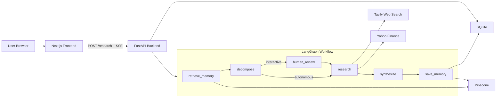
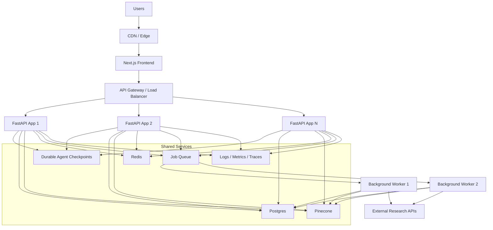

# Decision Making Deep Research Assistant

An AI-powered deep research agent that decomposes complex questions into sub-questions, conducts multi-source research, and synthesizes comprehensive answers.

## Stack

- **Backend**: FastAPI + LangGraph agent orchestration
- **Frontend**: Next.js + TypeScript + Tailwind CSS
- **LLM**: Configurable (Anthropic, OpenAI, or local Ollama models)
- **Tools**: Tavily web search + Yahoo Finance
- **Memory**: Pinecone (vector RAG) + SQLite (conversation history)

## Current architecture



## Why it works for local development

This architecture is intentionally compact. The frontend talks to a single backend, the backend owns the full LangGraph workflow, and persistence stays simple with SQLite for conversation history and Pinecone for semantic memory.

That makes local development and Docker-based iteration easier: there are only a few moving parts, streaming is straightforward over SSE, and in-memory checkpointing is acceptable when the app is running as a single backend process.

## Future architecture for multi-user scale



As the system grows beyond a single local instance, the main architectural shift is from process-local simplicity to shared infrastructure. SQLite would likely move to Postgres, in-memory LangGraph checkpoints would become durable, and longer-running research jobs would be better handled through a queue and worker model.

## Tradeoffs

This project intentionally favors simplicity and iteration speed over full production hardening. A deeper write-up on the design tradeoffs is available in [docs/TRADEOFFS.md](./docs/TRADEOFFS.md).

## Project context

This repo also has a short write-up on why the project exists in the first place, including the personal testing angle, the motivation for experimenting with local models such as Qwen, and the desire to learn more about architecture and product tradeoffs. See [docs/PROJECT_CONTEXT.md](./docs/PROJECT_CONTEXT.md).

## Quick Start

### Prerequisites

- [uv](https://docs.astral.sh/uv/) (Python package manager)
- Node.js 20+
- API keys: Tavily and Pinecone, plus Anthropic/OpenAI if using hosted models
- Optional local model runtime: Ollama

### 1. Configure environment

```bash
cp .env.example .env
# Edit .env with your API keys and model settings
# For backend-only local runs, you can also copy backend/.env.example to backend/.env
```

### 2. Run the backend

```bash
cd backend
uv sync
uv run uvicorn app.main:app --reload
```

Backend runs at http://localhost:8000

### 3. Run the frontend

```bash
cd frontend
npm install
npm run dev
```

Frontend runs at http://localhost:3000

### 4. Or use Docker Compose

```bash
docker-compose up --build
```

This Docker workflow expects local ports `3000` and `8000` to be available.

## Usage

1. Open http://localhost:3000
2. Toggle **Autonomous** / **Interactive** mode
   - **Autonomous**: Agent researches fully automatically
   - **Interactive**: Agent pauses after decomposition so you can review/edit sub-questions
3. Type a research question and press Enter

### Example queries

- "What is the current stock price of Apple and what are analysts saying about it?"
- "Compare the financial performance of Tesla and Ford in the past year"
- "What are the latest developments in quantum computing?"

## Project Structure

```
backend/
  app/
    main.py              # FastAPI entry point
    schemas.py           # Pydantic request/response models
    agent/
      graph.py           # LangGraph StateGraph
      nodes.py           # Graph nodes
      state.py           # AgentState TypedDict
      llm.py             # LLM factory (OpenAI / Anthropic)
      tools/
        web_search.py    # Tavily search
        yahoo_finance.py # yfinance wrapper
    memory/
      conversation_store.py  # SQLite CRUD
      pinecone_client.py     # Vector memory
    api/routes/
      research.py        # POST /research, POST /research/{id}/clarify
      health.py          # GET /health

frontend/
  src/
    app/page.tsx         # Main chat page
    components/
      ChatInput.tsx
      MessageList.tsx
      ResearchProgress.tsx
      ModeToggle.tsx
    lib/api.ts           # Fetch + SSE client
```

## Environment Variables

| Variable            | Description                         | Required                           |
| ------------------- | ----------------------------------- | ---------------------------------- |
| `LLM_PROVIDER`      | `openai`, `anthropic`, or `ollama`  | No (default: `anthropic`)          |
| `LLM_MODEL`         | Model ID (e.g. `claude-sonnet-4-6`) | Yes                                |
| `ANTHROPIC_API_KEY` | Anthropic API key                   | If using Anthropic                 |
| `OPENAI_API_KEY`    | OpenAI API key                      | If using OpenAI                    |
| `OLLAMA_BASE_URL`   | Local Ollama base URL               | If using Ollama                    |
| `TAVILY_API_KEY`    | Tavily search API key               | Yes                                |
| `PINECONE_API_KEY`  | Pinecone API key                    | Yes                                |
| `PINECONE_INDEX`    | Pinecone index name                 | Yes                                |
| `SQLITE_DB_PATH`    | Path to SQLite DB file              | No (default: `./data/research.db`) |
